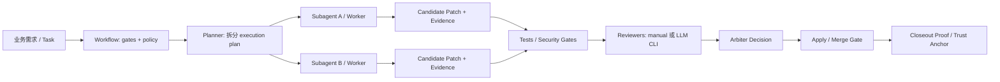

# AGOS

> Executor-agnostic governance layer for AI coding agents. **Agent writes. AGOS verifies. CI enforces.**

AGOS 是一个面向 AI 编程代理的本地/CI 治理层。它不替代 Codex、Claude Code、Multica 或 OpenHands，而是在这些执行器之上提供任务记录、子代理编排、候选补丁、审查证据、信任锚和合并门禁。

适合你在以下场景使用：

- 让 Codex CLI、Claude Code、Multica、OpenHands 等不同执行器按同一套治理流程工作。
- 把一个大任务拆成多个 subagent 子任务，并限制每个子任务的写入范围。
- 将业务 workflow 映射成 gates、reviewers、arbiters 和 merge-gate。
- 在 CI 中证明：提交的补丁来自受控候选、测试/审查证据完整、ledger 未被篡改。
- 把任务执行、审查反馈、关闭证明沉淀为后续迭代和自我蒸馏的数据资产。

当前状态：`0.1.0`，Alpha。CI 覆盖 Python 3.11 / 3.12；项目声明支持 Python `>=3.11`。

此项目web控制台部分参考 https://github.com/zhang3xing1/Input-Kanban 感谢掌星大佬的开源


注：此项目全程为AI制作没有人工审核，仅供参考
---

## 目录

- [核心能力](#核心能力)
- [工作模型](#工作模型)
- [执行模式与离线边界](#执行模式与离线边界)
- [可视化控制台](#可视化控制台)
- [安装](#安装)
- [5 分钟上手：Codex CLI 本地治理闭环](#5-分钟上手codex-cli-本地治理闭环)
- [多代理流水线：按业务拆分 subagent](#多代理流水线按业务拆分-subagent)
- [自动规划：业务逻辑驱动 workflow](#自动规划业务逻辑驱动-workflow)
- [审查器：manual、fake、LLM CLI 的区别](#审查器manualfakellm-cli-的区别)
- [配置参考](#配置参考)
- [CI、信任锚与合并门禁](#ci信任锚与合并门禁)
- [本地验证与真实 Codex CLI 集成测试](#本地验证与真实-codex-cli-集成测试)
- [发布构建](#发布构建)
- [常见问题](#常见问题)

---

## 核心能力

| 能力 | 用途 |
| --- | --- |
| Task Ledger | 为每个 AGOS 任务维护 hash-chained ledger，记录开始、checkpoint、候选、审查、决策和 closeout。 |
| Workflows & Gates | 在 `.agos/agos.yaml` 中按业务 workflow 锁定测试、安全扫描、策略检查等 gates。 |
| Workers / Subagents | 将任务拆到 `local_worktree`、`codex_cli`、`claude_code`、`multica`、`openhands` 等 worker。 |
| Execution Plan | 用 YAML/JSON 描述子任务 DAG、依赖关系、写入范围和 worker 分配。 |
| Candidate Patches | 每个 subagent 在隔离 workspace 中产出候选补丁，AGOS 记录 patch hash 与 evidence。 |
| Review Orchestration | 支持 manual reviewer、dev fake reviewer、Codex/Claude LLM CLI reviewer。 |
| Trust Anchors | 将 ledger head 发布到 file、protected git ref 或离线 Ed25519 signed file，供 CI 做不可变验证。 |
| Merge Gate | 在 CI 中验证 ledger、trust anchor、candidate patch、test/review evidence、PR diff binding 与 provenance policy。 |

---

## 工作模型

AGOS 把“让 AI 写代码”拆成可验证的流水线：



核心映射关系：

- **业务划分** → `workflows`、`ExecutionPlan.subtasks[*].title/intent/write_scope`
- **subagent / skill tree** → `workers` + 每个 subtask 的 `worker.adapter` / `worker.role`
- **业务逻辑驱动 workflow** → `default_workflow`、`workflows.<name>.gates`、`orchestration.planner`
- **按节点调用 subagent** → `agos run start --plan ...` 或 `agos run auto ...`
- **自我蒸馏迭代升级** → ledger、review findings、candidate evidence、closeout proof 可作为下一轮 prompt、policy、skill 或 workflow 的输入

边界说明：AGOS 当前提供证据闭环和自动/半自动编排；它不会自动训练模型，也不会自动改写你的 Codex/Claude skill。自我蒸馏通常由你在 AGOS evidence 基础上接一个外部总结、提示词更新或 skill 更新流程完成。

---

## 执行模式与离线边界

`agos start` 支持两种兼容模式：

- `legacy`：直接调度已有 executor，保留旧 issue/run ID 输出和 `outputs/<task-id>/` 约定。
- `candidate`：在隔离 worktree 中运行 worker，依次完成 patch、gates、review、accepted decision 和 guarded apply。

```bash
agos start --title "Compatibility run" --mode legacy
agos start --title "Governed source change" --mode candidate --json
```

旧配置没有 `task_execution` 时按 `legacy/legacy` 解释，旧 task YAML 不会被重写。新 Codex/Claude init 默认写入 `candidate/source_code`；无法提供自动 reviewer 的初始化会显式回退 `legacy/legacy` 并打印原因。

完全离线自动化可使用结构化 argv 的 `command` worker 和禁用 planner 的 deterministic fallback。AGOS 不会为 readiness 或 command worker 主动发起网络请求，但被执行的命令本身是否联网仍由该命令决定。完整配置、output contract 和迁移说明见 [`docs/execution-modes.md`](docs/execution-modes.md)。

---

## 可视化控制台

AGOS 提供本地 Dashboard，用浏览器提交新任务并展示当前 `.agos/` 治理状态：

```bash
agos dashboard --port 0 --open
```

默认行为：

- 绑定 `127.0.0.1`，不对外暴露。
- 支持从页面输入任务标题、意图、execution mode、workflow 和 gate override，创建并启动新的 AGOS task。
- 独立小游戏、demo 或网页类产物默认要求执行器输出到 `outputs/<task-id>/`，Dashboard 的运行概览会展示该输出目录。
- 除“创建任务并启动”外，其余控制台区域仍以读取 `.agos/` 状态和 evidence 为主。
- 左侧展示当前 AGOS run，右侧展示 workflow、subagent 节点、candidate、review、merge-gate、ledger evidence 和自我蒸馏摘要。
- evidence viewer 只允许读取 `.agos/tasks/current` 中被允许的 task/evidence refs，拒绝路径穿越和任意文件读取。

常用命令：

```bash
agos dashboard
agos dashboard --host 127.0.0.1 --port 8788
agos dashboard --port 0 --no-open
```

如果页面提示尚未初始化，请先运行：

```bash
agos init
agos start --title "Your task"
```

---

## 安装

### 从 PyPI 或发布 wheel 安装

配置 PyPI trusted publishing 后，正式版本可直接安装：

```bash
python -m pip install agos
agos version
```

也可从 GitHub Release 下载 `agos-dist` 中构建的 wheel：

```bash
pip install agos-0.1.0-py3-none-any.whl
agos version
agos --help
```

`release` workflow 对 `v*` tag 运行 provider-free 验证，从同一个 artifact 创建 GitHub Release assets 并通过 OIDC 发布 PyPI；首次发布前需按 [`docs/release-install.md`](docs/release-install.md) 配置 `pypi` environment 和 trusted publisher。

### 从源码开发安装

```bash
git clone https://github.com/zsr131550/agos.git
cd agos
python -m pip install --upgrade pip
python -m pip install -e ".[dev]"
agos --help
```

可选 LangGraph backend：

```bash
python -m pip install -e ".[dev,langgraph]"
```

### 外部工具要求

基础要求：

- Python `>=3.11`
- Git
- legacy 或 LLM candidate 流程需要至少一个本地 AI 执行器，常用：
  - Codex CLI：`codex --version`
  - Claude Code：`claude --version`
  - Multica：`multica daemon status`
  - OpenHands endpoint
- provider-free candidate 流程可只配置本地 `command` worker；详见 [`docs/execution-modes.md`](docs/execution-modes.md)。

---

## 5 分钟上手：Codex CLI 本地治理闭环

下面以 Codex CLI 为例。请在一个 Git 仓库根目录运行。

### 1. 初始化 AGOS

```bash
agos init --executor codex_cli --agent codex:codex
```

这会创建：

- `.agos/agos.yaml`：AGOS 配置
- `.agos/tasks/current/`：当前任务状态目录
- `.git/hooks/pre-commit` 和 `.git/hooks/pre-push`：本地 advisory gates

如果你不指定 `--agent`，`agos init` 会发现本地可用 agent 并进入交互式选择。

### 2. 检查环境

```bash
agos doctor
agos config validate
agos worker doctor
```

机器可读输出：

```bash
agos doctor --json
agos config show --json
agos worker doctor --json
```

### 3. 启动任务

```bash
agos start \
  --title "Add API usage examples" \
  --intent "Update README and tests for the public CLI examples" \
  --workflow feature
```

AGOS 会：

1. 写入 active task metadata。
2. 锁定 workflow gates。
3. 根据 `task_execution.mode` 调用 legacy executor，或执行 candidate worker/test/review/decision/apply 闭环。
4. 把归一化结果写入 `execution/task-execution.json`，并将过程写入 ledger/evidence。

可用 `--mode legacy|candidate` 覆盖单次运行。`candidate` 始终走 guarded apply；需要 dry-run 时继续使用 `agos run auto --dry-run --json`。

### 4. checkpoint 与本地 gate

```bash
agos checkpoint --once
agos ci --local --stage pre-commit
```

`checkpoint` 会把执行器消息、当前 repo anchor 和 ledger head 记录下来。`ci --local` 是本地 advisory 检查；真正的强制合并控制应放到 CI 的 `agos merge-gate`。

### 5. 关闭任务

```bash
agos closeout
agos status
```

如果存在 blocking review finding 或 evidence 不完整，closeout 会失败并指出需要补齐的内容。

---

## 多代理流水线：按业务拆分 subagent

多代理路径推荐用于“大任务拆小任务”：每个 subagent 在隔离 Git worktree 中工作，产出 candidate patch，再由 AGOS 做测试、审查、决策和 apply。

### 1. 配置 workers

`.agos/agos.yaml` 示例：

```yaml
executor:
  name: codex_cli
  agent: codex
  command: codex

default_workflow: feature

workers:
  docs_agent:
    type: codex_cli
    command: codex
    timeout_seconds: 180
    artifact_globs:
      - .agos-worker/*.json

  test_agent:
    type: codex_cli
    command: codex
    timeout_seconds: 180

  local_patch_agent:
    type: local_worktree

workflows:
  feature:
    gates:
      - id: tests_pass
        stage: [pre-commit, pre-push, candidate]
        argv: [pytest, -q]
      - id: no_secrets_in_diff
        stage: [pre-commit, pre-push, candidate]
        type: secret_scan

orchestration:
  backend: native_async
  max_parallel: 2
  max_retries: 1
  worker_timeout_seconds: 900
  retry_backoff_seconds: 5
```

### 2. 创建 execution plan

`task_id` 必须匹配当前 active task。可用 `agos status --json` 查看。

`execution-plan.yaml`：

```yaml
id: plan-readme-release
# 替换为 agos status --json 中的 task id
task_id: agos-01
max_parallel: 2
requires_candidate_review: true
subtasks:
  - id: docs-usage
    title: Write publishable usage README
    intent: Explain install, quickstart, Codex CLI workflow, config and CI gate.
    write_scope:
      - README.md
      - docs
    worker:
      adapter: docs_agent
      role: docs_writer

  - id: tests-docs
    title: Verify public examples
    intent: Check documented commands and add/adjust tests when examples expose broken CLI behavior.
    depends_on:
      - docs-usage
    write_scope:
      - tests
      - docs
    worker:
      adapter: test_agent
      role: test_engineer
```

规则：

- `write_scope` 必填，且不能是 `.` 或绝对路径。
- 并行子任务的 `write_scope` 不能重叠；如果重叠，必须用 `depends_on` 串行化。
- `worker.adapter` 必须是 `.agos/agos.yaml` 中已配置的 worker 名称。

### 3. 启动并查看 run

```bash
agos run start --plan execution-plan.yaml --json
agos run status <run-id> --json
agos run resume <run-id> --json
```

兼容命令：

```bash
agos execute-plan run --plan execution-plan.yaml --json
agos run run --plan execution-plan.yaml --json
```

### 4. 提交、测试、审查、决策候选补丁

```bash
agos candidate list
agos candidate submit docs-usage --summary "README usage tutorial"
agos candidate test <candidate-id>
agos candidate review <candidate-id> --packet-only
```

如果你配置了自动 reviewer，也可以直接运行 candidate review 流程：

```bash
agos candidate review <candidate-id>
```

审查完成后：

```bash
agos candidate decide <candidate-id> \
  --decision accepted \
  --reason "Tests and review evidence are complete"

agos candidate apply <candidate-id>
```

AGOS 会在 apply 前校验 patch hash、write scope、测试 evidence、review binding 和 ledger 状态。

### 5. 多候选合并策略

当多个候选都被接受时，可使用 bundle 决策：

```bash
agos candidate merge decide
agos candidate merge preview <bundle-decision-id>
agos candidate merge apply <bundle-decision-id>
```

支持的策略：

| Strategy | 自动 apply | 含义 |
| --- | ---: | --- |
| `single_candidate` | 是 | 一个 accepted candidate，通过所有 guard。 |
| `non_overlapping_bundle` | 是 | 多个 accepted candidates，写入范围不重叠。 |
| `ordered_patch_stack` | 是 | 多个 accepted candidates 有明确顺序，临时 stack workspace dry-run 通过。 |
| `manual_merge_required` | 否 | dirty paths、冲突、证据缺失或顺序不明确，需要人工处理。 |

---

## 自动规划：业务逻辑驱动 workflow

AGOS 可以让 Codex/Claude 先作为 planner 生成 execution plan，再按节点调用 worker。开启方式：

```yaml
orchestration:
  backend: native_async
  max_parallel: 2
  max_retries: 1
  fallback_write_scope:
    - README.md
    - src/agos
    - tests
    - docs
  planner:
    enabled: true
    executor: codex_cli
    command: codex
    timeout_seconds: 120
```

运行 dry-run：

```bash
agos run auto --dry-run --json
```

确认 evidence 后自动 apply：

```bash
agos run auto --apply --json
```

如果当前没有配置 reviewer，但你在本地实验中希望允许通过：

```bash
agos run auto --dry-run --allow-missing-review --json
```

生产环境不建议依赖 `--allow-missing-review`。推荐至少配置一个 manual 或 LLM CLI reviewer。

规划失败时，AGOS 会使用保守 fallback plan：单个 subtask、首个可用 worker、`fallback_write_scope` 限定的写入范围。

---

## 审查器：manual、fake、LLM CLI 的区别

Reviewer 不等同于 worker。Worker 负责“改代码/产出 patch”，Reviewer 负责“审查 evidence/patch 并产出 findings”。因此 reviewer 不会默认走 worker adapter。

| Reviewer type | 是否调用 agent | 用途 |
| --- | --- | --- |
| `manual` | 否 | 创建 review packet，等待人或外部系统提交 findings。适合生产审批。 |
| `fake` | 否 | 测试/开发用 reviewer。需要 `allow_fake_reviewer: true`，不建议生产使用。 |
| `codex_cli` | 是 | 调用 Codex CLI 作为审查器，生成 normalized findings。 |
| `claude_code` | 是 | 调用 Claude Code 作为审查器，生成 normalized findings。 |

### 配置 Codex reviewer

```yaml
reviewers:
  security:
    type: codex_cli
    executor: codex_cli
    command: codex
    role: security_reviewer
    required: true
    timeout_seconds: 180
    blocking_severity: high
```

运行：

```bash
agos review run --reviewer security
```

### 配置 manual reviewer

```yaml
reviewers:
  security_manual:
    type: manual
    role: security_reviewer
    required: true
    blocking_severity: high
```

生成 packet：

```bash
agos review --packet-only
```

导入 normalized findings：

```bash
agos review --ingest findings.json --review-id <review-id>
```

`findings.json` 结构示例：

```json
{
  "findings": [
    {
      "id": "finding-001",
      "review_id": "review-abc",
      "source_agent": "security_manual",
      "category": "security",
      "severity": "high",
      "blocking": true,
      "title": "Unsafe shell command construction",
      "body": "User-controlled input reaches a shell command without argv separation.",
      "location": {"file": "src/example.py", "line": 42},
      "evidence_refs": ["reviews/review-abc/packet.json"],
      "suggested_fix": "Use structured argv and avoid shell=True."
    }
  ]
}
```

解决 finding：

```bash
agos resolve finding-001 \
  --status resolved \
  --evidence reviews/review-abc/report.json \
  --rationale "Replaced shell command with structured argv"
```

---

## 配置参考

`.agos/agos.yaml` 是 AGOS 的主配置。常用字段如下。

```yaml
executor:
  name: codex_cli        # multica | codex_cli | claude_code
  agent: codex
  command: codex

default_workflow: feature

task_execution:
  mode: candidate       # legacy | candidate
  output_contract: source_code  # legacy | source_code | standalone

workers:
  codex:
    type: codex_cli      # local_worktree | command | codex_cli | claude_code | multica | openhands
    command: codex
    timeout_seconds: 120
    poll_interval_seconds: 2
    artifact_globs:
      - .agos-worker/*.json
    env: {}
    health_probe: false

  offline_command:
    type: command
    argv: [python, -c, "from pathlib import Path; Path('README.md').touch()"]
    timeout_seconds: 30

reviewers:
  security:
    type: codex_cli      # manual | fake | codex_cli | claude_code
    executor: codex_cli
    command: codex
    role: security_reviewer
    required: true
    timeout_seconds: 120
    blocking_severity: high

workflows:
  feature:
    gates:
      - id: tests_pass
        stage: [pre-commit, pre-push, candidate]
        argv: [pytest, -q]
      - id: no_secrets_in_diff
        stage: [pre-commit, pre-push, candidate]
        type: secret_scan

  docs_only:
    gates: []

orchestration:
  backend: native_async   # native_async | external | langgraph
  max_parallel: 2
  max_retries: 1
  worker_timeout_seconds: 900
  retry_backoff_seconds: 5
  max_tick_iterations: 20
  fallback_write_scope:
    - README.md
    - src/agos
    - tests
    - docs
  planner:
    enabled: false
    executor: codex_cli
    command: codex
    timeout_seconds: 60

trust_anchor:
  backend: git-ref        # file | git-ref
  path: null
  auto_publish_on_checkpoint: false
  issuer: agos

merge_gate:
  provenance_policy: optional   # required | optional | disabled
  trusted_signers:
    - issuer: local-release
      key_id: release-2026
      # 相对当前受信 .agos/agos.yaml，且不能逃逸该目录
      public_key_path: keys/release.pub.pem
```

省略 `merge_gate.provenance_policy` 时默认使用 `optional`，以兼容现有仓库和旧 candidate JSON。`required` 只接受由允许签名者覆盖的 `worker_export` / `external_attested` 候选；`ci_reconstructed` 永远不会被声明为 Agent provenance。完整迁移和离线签名步骤见 [`docs/provenance.md`](docs/provenance.md)。

省略 `task_execution` 时默认使用 `legacy/legacy`，保持旧 CLI 和 `.agos` 归档行为。执行模式、离线 command worker 与 output contract 迁移见 [`docs/execution-modes.md`](docs/execution-modes.md)。

### Gate 类型

AGOS 支持三类 gate：

```yaml
# 1. shell-style command，兼容旧配置
- id: tests_pass
  stage: [pre-commit]
  command: "pytest -q"

# 2. structured argv，跨平台推荐
- id: tests_pass
  stage: [pre-commit, candidate]
  argv: [pytest, -q]

# 3. built-in / external typed gate
- id: semgrep_security
  stage: [pre-push, candidate]
  type: semgrep
  options:
    config: p/security-audit
```

内置 typed gate：`secret_scan`、`opa`、`semgrep`、`trufflehog`、`codeql`。详见 [`docs/security-gates.md`](docs/security-gates.md)。

### Orchestration backend

| Backend | 说明 |
| --- | --- |
| `native_async` | 默认语义参考实现，本地执行 worker DAG。 |
| `external` | 将 normalized run spec 发送到远端 orchestrator。 |
| `langgraph` | 安装 `.[langgraph]` 后，可将同一 DAG 编译到 LangGraph。 |

External backend endpoint 需要实现：

- `POST /runs`
- `GET /runs/{run_id}`
- `POST /runs/{run_id}/cancel`
- `GET /runs/{run_id}/artifacts`

---


## Autonomous Agent Review Loop Examples

`agos start --mode candidate` is the default guarded product entrypoint for this loop. `agos run auto` remains the compatible advanced-control entrypoint: active task -> execution plan -> worker/subagent assignment -> candidate patch -> candidate gates -> local reviewer -> candidate decision -> guarded apply only when `--apply` is present.

### Minimal local fallback

When the LLM planner is disabled or unavailable, AGOS creates a deterministic fallback plan: one subtask, the first available worker, and the configured `fallback_write_scope`. This is the safest offline/CI baseline. A required `manual` reviewer is human-in-the-loop and will block automatic acceptance until findings are ingested; use `codex_cli` or `claude_code` for a fully local agent-review loop.

```yaml
workers:
  local_worktree:
    type: local_worktree

reviewers:
  manual_security:
    type: manual
    role: security_reviewer
    required: true

orchestration:
  backend: native_async
  max_parallel: 1
  fallback_write_scope:
    - README.md
    - src/agos
    - tests
    - docs
  planner:
    enabled: false
```

### Planner + Codex worker + Codex reviewer

```yaml
workers:
  codex_impl:
    type: codex_cli
    command: codex
    timeout_seconds: 900
    artifact_globs:
      - .agos-worker/*.json

reviewers:
  codex_review:
    type: codex_cli
    executor: codex_cli
    command: codex
    role: security_reviewer
    required: true
    timeout_seconds: 180
    blocking_severity: high

orchestration:
  backend: native_async
  max_parallel: 1
  max_retries: 1
  worker_timeout_seconds: 900
  planner:
    enabled: true
    executor: codex_cli
    command: codex
    timeout_seconds: 60
```

### Multi-worker Codex / Claude split

Planner output must assign every subtask to a configured `worker.adapter`. `agos run auto --json` reports `planner_source`, `subtask_worker_assignments`, `reviewer_ids`, `candidate_review_ids`, raw review refs, and any blocked stage/reason.

```yaml
workers:
  codex_impl:
    type: codex_cli
    command: codex
    timeout_seconds: 900
  claude_docs:
    type: claude_code
    command: claude
    timeout_seconds: 900

reviewers:
  codex_review:
    type: codex_cli
    executor: codex_cli
    command: codex
    role: security_reviewer
    required: true

orchestration:
  backend: native_async
  max_parallel: 2
  max_retries: 1
  worker_timeout_seconds: 900
  planner:
    enabled: true
    executor: codex_cli
    command: codex
    timeout_seconds: 60
```

Check readiness before running the autonomous loop:

```bash
agos doctor
agos config validate
```

If no reviewer is configured, `agos run auto` will not accept candidates by default. For local experiments only, use:

```bash
agos run auto --dry-run --allow-missing-review --json
```

`--allow-missing-review` is a non-production escape hatch. Production loops should configure a `manual`, `codex_cli`, or `claude_code` reviewer and require review evidence in the merge gate.

### Real agent smoke tests

Default tests do not call real Codex, Claude, Multica, or OpenHands. Enable smoke tests explicitly during local release validation:

```bash
AGOS_PLANNER_SMOKE=1 AGOS_PLANNER_BIN=codex python -m pytest tests/integration/test_planner_cli_opt_in.py -q
AGOS_REVIEWER_SMOKE=1 AGOS_REVIEWER_BIN=codex python -m pytest tests/integration/test_reviewer_cli_opt_in.py -q
AGOS_CODEX_WORKER_SMOKE=1 AGOS_CODEX_BIN=codex python -m pytest tests/integration/test_worker_adapters_opt_in.py -q
AGOS_MULTICA_WORKER_SMOKE=1 python -m pytest tests/integration -q
AGOS_OPENHANDS_WORKER_SMOKE=1 python -m pytest tests/integration -q
```

## CI, Trust Anchors, and Merge Gate

Local Git hooks are advisory; developers can bypass them with `--no-verify`. The enforced boundary is CI. Required CI does not call a model provider or require provider credentials. Real planner/reviewer/worker smoke tests live in the opt-in `real-agent-smoke` workflow.

For pull requests, both governance jobs use two independent checkouts: `trusted` is the protected base revision and supplies the installed AGOS verifier plus `.agos/agos.yaml`; `subject` is the PR head and supplies only the diff and generated `.agos/tasks/current` evidence. Subject code cannot weaken the verifier, workflow gates, provenance policy, or allowed signing keys.

- `autonomous-readiness`: checks configuration, local CLI readiness, and the provider-independent CI policy.
- `agos-prepare`: runs the protected-base verifier in the subject checkout and reconstructs deterministic candidate/test evidence. It does not synthesize Agent review, acceptance, apply, or provenance.
- `merge-gate`: downloads only `subject/.agos/tasks/current` and verifies it with protected-base code/config.
- `real-agent-smoke`: opt-in/scheduled integration coverage for real Codex, Claude, Multica, and OpenHands paths; it is not a required offline check.

```bash
agos prepare-merge-gate \
  --base "$BASE_SHA" \
  --head "$HEAD_SHA" \
  --trusted-config "$GITHUB_WORKSPACE/trusted/.agos/agos.yaml" \
  --anchor-path ".agos/tasks/current/evidence/anchors.json" \
  --issuer "github-actions"

agos merge-gate \
  --require-anchor \
  --anchor-backend file \
  --anchor-path ".agos/tasks/current/evidence/anchors.json" \
  --trusted-config "$GITHUB_WORKSPACE/trusted/.agos/agos.yaml" \
  --base "$BASE_SHA" \
  --head "$HEAD_SHA" \
  --json
```

上面的重建流程在默认 `optional` 策略下输出 `provenance_state: unprovenanced`。若策略为 `required`，必须使用真实 worker/export 或外部 attestation 证据，并通过 `signed-file` anchor 覆盖对应 ledger；仅运行 `prepare-merge-gate` 会按设计被阻断。

`merge-gate` verifies:

- active task ledger hash chain;
- `gates_locked` matches the current workflow gate config;
- trust anchor matches the ledger head;
- candidate patch hash matches recorded evidence;
- candidate test evidence is complete;
- candidate review evidence is complete and current;
- submitted PR diff is bound to the applicable governed or reconstructed candidate evidence;
- structured output reports `provenance_state` as `proven`, `unprovenanced`, or `disabled` without silently upgrading reconstructed evidence.

See [`docs/provenance.md`](docs/provenance.md) for the policy matrix, legacy migration, offline Ed25519 commands, and trusted-config rules.

### CI real-agent smoke environment

`real-agent-smoke` is a strong proof job: CI sets the smoke flags to `1`, so missing credentials or services fail the job. Configure these GitHub secrets/vars:

| Name | Type | Purpose |
| --- | --- | --- |
| `OPENAI_API_KEY` | secret | Codex planner/reviewer/worker smoke |
| `ANTHROPIC_API_KEY` | secret | Claude worker smoke |
| `AGOS_OPENHANDS_ENDPOINT` | secret or var | OpenHands worker smoke endpoint |
| `AGOS_OPENHANDS_TOKEN` | secret, optional | OpenHands token |
| `AGOS_MULTICA_AGENT` | var, optional | Multica assignee; default `Lambda` |
| `AGOS_MULTICA_BIN` | var, optional | Multica CLI; default `multica` |
| `MULTICA_API_KEY` / `MULTICA_BASE_URL` | secret/var as required by Multica CLI | Multica worker smoke |

To block non-compliant PRs without provider dependencies, require `merge-gate`, `autonomous-readiness`, and the normal `verify` matrix in GitHub branch protection. Keep `real-agent-smoke` as an explicit release/integration signal unless provider access is intentionally part of the merge policy.

---

## Local Verification and Real Agent Integration Tests

Regular verification:

```bash
python -m ruff check src tests scripts
python -m compileall -q src tests scripts
python -m pytest -q
python -m pytest --cov=agos --cov-report=term-missing -q
python -m build
```

Local real-agent smoke tests still require explicit environment variables. CI's `real-agent-smoke` job sets these flags by default.

Bash / zsh:

```bash
AGOS_PLANNER_SMOKE=1 AGOS_PLANNER_BIN=codex \
  python -m pytest tests/integration/test_planner_cli_opt_in.py::test_planner_cli_produces_plan_json -q

AGOS_REVIEWER_SMOKE=1 AGOS_REVIEWER_BIN=codex \
  python -m pytest tests/integration/test_reviewer_cli_opt_in.py::test_llm_cli_reviewer_runs_real_cli -q

AGOS_CODEX_WORKER_SMOKE=1 AGOS_CODEX_BIN=codex \
  python -m pytest tests/integration/test_worker_adapters_opt_in.py::test_codex_worker_smoke -q

AGOS_CLAUDE_WORKER_SMOKE=1 AGOS_CLAUDE_BIN=claude \
  python -m pytest tests/integration/test_worker_adapters_opt_in.py::test_claude_worker_smoke -q

AGOS_MULTICA_WORKER_SMOKE=1 AGOS_MULTICA_BIN=multica AGOS_MULTICA_AGENT=Lambda \
  python -m pytest tests/integration/test_worker_adapters_opt_in.py::test_multica_worker_smoke -q

AGOS_OPENHANDS_WORKER_SMOKE=1 AGOS_OPENHANDS_ENDPOINT=http://openhands.local \
  python -m pytest tests/integration/test_worker_adapters_opt_in.py::test_openhands_worker_smoke -q
```

Windows PowerShell:

```powershell
$env:AGOS_PLANNER_SMOKE='1'; $env:AGOS_PLANNER_BIN='codex.cmd'
python -m pytest tests/integration/test_planner_cli_opt_in.py::test_planner_cli_produces_plan_json -q
Remove-Item Env:AGOS_PLANNER_SMOKE,Env:AGOS_PLANNER_BIN -ErrorAction SilentlyContinue

$env:AGOS_REVIEWER_SMOKE='1'; $env:AGOS_REVIEWER_BIN='codex.cmd'
python -m pytest tests/integration/test_reviewer_cli_opt_in.py::test_llm_cli_reviewer_runs_real_cli -q
Remove-Item Env:AGOS_REVIEWER_SMOKE,Env:AGOS_REVIEWER_BIN -ErrorAction SilentlyContinue

$env:AGOS_CODEX_WORKER_SMOKE='1'; $env:AGOS_CODEX_BIN='codex.cmd'
python -m pytest tests/integration/test_worker_adapters_opt_in.py::test_codex_worker_smoke -q
Remove-Item Env:AGOS_CODEX_WORKER_SMOKE,Env:AGOS_CODEX_BIN -ErrorAction SilentlyContinue

$env:AGOS_CLAUDE_WORKER_SMOKE='1'; $env:AGOS_CLAUDE_BIN='claude.cmd'
python -m pytest tests/integration/test_worker_adapters_opt_in.py::test_claude_worker_smoke -q
Remove-Item Env:AGOS_CLAUDE_WORKER_SMOKE,Env:AGOS_CLAUDE_BIN -ErrorAction SilentlyContinue
```

---

## 发布构建

构建 release artifacts：

```bash
python -m build --no-isolation
python scripts/verify_release.py --tag v0.1.0 --dist dist
```

安装并 smoke-test wheel：

```bash
python -m venv .venv-release
. .venv-release/bin/activate
pip install --upgrade pip
pip install --force-reinstall dist/agos-0.1.0-py3-none-any.whl
agos version
agos --help
agos run --help
agos merge-gate --help
```

Windows PowerShell 激活虚拟环境：

```powershell
python -m venv .venv-release
.\.venv-release\Scripts\Activate.ps1
pip install --upgrade pip
pip install --force-reinstall dist\agos-0.1.0-py3-none-any.whl
agos version
```

完整发布流程见 [`docs/release-install.md`](docs/release-install.md)。

---

## 常见问题

### AGOS 会直接替我 merge AI 写的代码吗？

不会盲目 merge。AGOS 的设计是：agent 产出 candidate patch，AGOS 验证 patch hash、write scope、gates、review evidence，再按决策 apply。CI 的 `merge-gate` 才是强制合并边界。

### reviewer 为什么不能像 worker 一样“调用 agent”？

可以，但只有 LLM CLI reviewer 会调用 agent。`manual` 是人工/外部系统审查入口，`fake` 是测试替身；它们不应该调用 worker。要让 reviewer 调 Codex，请配置：

```yaml
reviewers:
  security:
    type: codex_cli
    executor: codex_cli
    command: codex
    role: security_reviewer
```

### `agos init` 找不到 agent 怎么办？

先确认本地 CLI 可用：

```bash
codex --version
claude --version
multica agent list --output json
```

然后显式指定：

```bash
agos init --executor codex_cli --agent codex:codex
```

### 没有 reviewer 能不能跑自动流程？

本地实验可以：

```bash
agos run auto --dry-run --allow-missing-review --json
```

生产环境不推荐。应配置 manual 或 LLM CLI reviewer，并在 merge gate 中要求 review evidence。

### AGOS 的信任边界是什么？

- `.agos/tasks/current/ledger.jsonl` 是 tamper-evident，不是不可变存储。
- trust anchor 把 ledger head 发布到 ledger 外部，用于 CI 验证。
- file anchor 适合本地和 GitHub artifact；protected git ref 或可信 CI publisher 更适合生产。
- AGOS 不能替你配置 GitHub branch protection；你必须单独要求 `merge-gate` status check。

---

## License

MIT. See [`LICENSE`](LICENSE).
